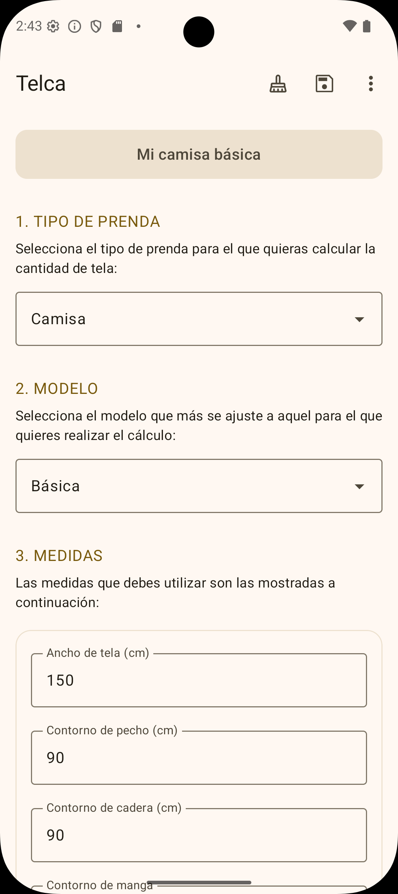
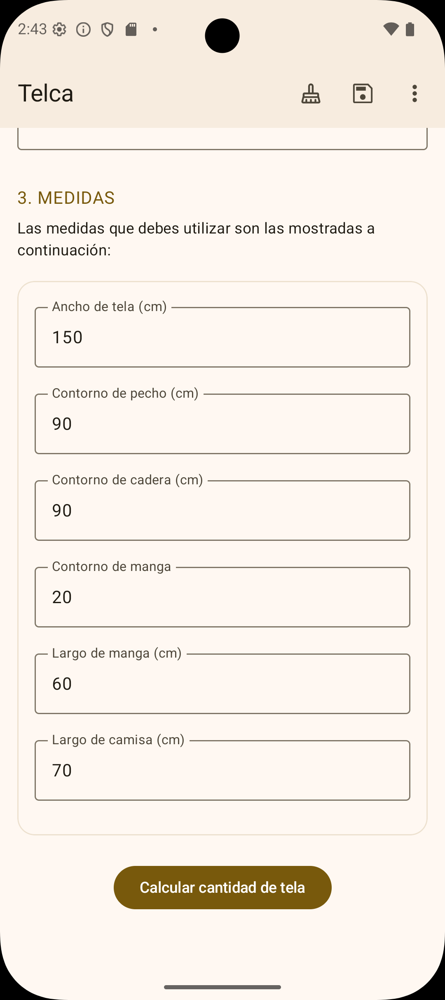
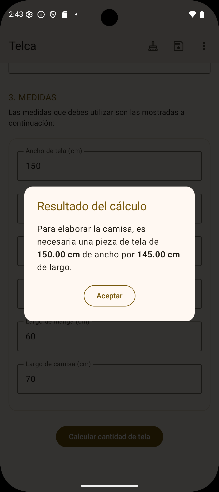

# Telca: calculadora de Tela

**Telca** es una solución móvil diseñada para entusiastas de la costura. La aplicación facilita el 
cálculo preciso de la cantidad de tela necesaria para diversos proyectos de confección, optimizando
el uso de materiales y reduciendo el desperdicio.

  &nbsp;&nbsp;
  &nbsp;&nbsp;
  

## Propósito de la App

El objetivo principal de Telca es digitalizar y simplificar el proceso de medición y cálculo en la
modistería. Permite a los usuarios gestionar trabajos, registrar medidas específicas y obtener cálculos
exactos basados en tipos de prendas, asegurando resultados profesionales en cada costura.

## Stack tecnológico

La aplicación está construida utilizando las últimas tecnologías y herramientas del ecosistema Android:

- **Lenguaje:** [Kotlin](https://kotlinlang.org/)
- **UI Framework:** [Jetpack Compose](https://developer.android.com/jetpack/compose) (Material 3)
- **Inyección de Dependencias:** [Hilt](https://developer.android.com/training/dependency-injection/hilt-android) (Dagger)
- **Persistencia de Datos:** [Room Database](https://developer.android.com/training/data-storage/room)
- **Asincronía:** [Kotlin Coroutines](https://kotlinlang.org/docs/coroutines-overview.html) & [Flow](https://kotlinlang.org/docs/flow.html)
- **Navegación:** [Jetpack Navigation Compose](https://developer.android.com/jetpack/compose/navigation)
- **Serialización:** [Kotlinx Serialization](https://github.com/Kotlin/kotlinx.serialization)
- **Monetización:** [Google Mobile Ads SDK](https://developers.google.com/admob/android/quick-start)
- **Testing:** JUnit 4/5, MockK y Compose UI Test.

## Arquitectura y patrones

Telca sigue los estándares más altos de desarrollo para garantizar una aplicación escalable, mantenible
y testeable:

### 1. Clean architecture

El proyecto está dividido en capas con responsabilidades claramente definidas:
- **Domain:** Contiene la lógica de negocio pura (Entities, Use Cases, Repository interfaces). Es 
independiente de cualquier framework.
- **Data:** Implementación de repositorios, manejo de base de datos local (Room) y mappers para 
transformar modelos de datos a modelos de dominio.
- **UI (Presentation):** Implementación de la interfaz de usuario con Compose y lógica de presentación.

### 2. MVVM (Model-View-ViewModel)

Se utiliza el patrón MVVM para separar la interfaz de usuario de la lógica de negocio, utilizando 
**StateFlow** y **SharedFlow** para exponer estados y mensajes de UI de manera reactiva y segura 
frente al ciclo de vida.

### 3. Principios SOLID

La base del código aplica rigurosamente los principios SOLID:
- **S**: Clases con una única responsabilidad (por ejemplo, UseCases específicos).
- **O**: Arquitectura abierta a la extensión mediante interfaces y herencia bien implementadas.
- **L**: Sustitución correcta de implementaciones en el grafo de dependencias.
- **I**: Interfaces de repositorio y validadores específicas correctamente diferenciadas.
- **D**: Inyección de dependencias mediante Hilt para desacoplar componentes.

## Seguridad y configuración

El proyecto implementa el **Secrets Gradle Plugin** para la gestión segura de claves sensibles (API
Keys, AdMob IDs, etc.):
- Las propiedades sensibles se almacenan en un archivo `secrets.properties` (excluido del control de
versiones).
- Se utiliza `BuildConfig` para acceder a constantes de configuración de manera segura durante el 
tiempo de compilación.

## Calidad de código

- **Unit Testing:** Cobertura de lógica de negocio en las capas de datos y dominio.
- **Instrumented UI Testing:** Cobertura de funcionamiento de componentes de UI e interacción entre ellos.
- **Mappers:** Transformación de datos desacoplada para evitar fugas de detalles de implementación 
de la base de datos a la UI.
- **Validators:** Lógica centralizada para la validación de entradas de usuario y medidas.

**Desarrollado por:** [Fernando Talero]  
**Versión:** 0.1-beta  
**Status:** Finalizada la primera versión beta.
